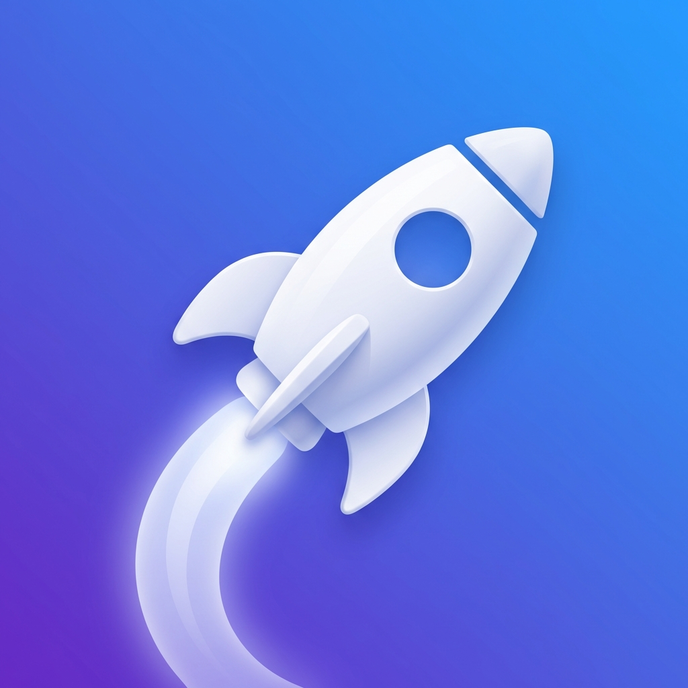

<div align="center">
  

  <h1>DevLaunch</h1>

  <p><strong>プロジェクトフォルダをスキャンし、ワンクリックでエディタ＋AI CLI を起動する macOS メニューバーアプリ。</strong></p>
  <p>A macOS menu bar app that scans your project folders and launches your editor + AI CLI in one click.</p>

  <p>
    
    
    
  </p>

  <p><a href="#日本語">日本語</a> · <a href="#english">English</a></p>
</div>

---

## 日本語

### これは何？

DevLaunch は、Claude Code / Codex などの AI CLI を日常的に使う開発者のための macOS メニューバー常駐アプリです。

指定したフォルダ内のプロジェクト（`.git` を持つサブディレクトリ）を自動でスキャンし、メニューバーから一覧表示。プロジェクト名をクリックするだけで、**エディタを開き、その統合ターミナルで AI CLI を起動**します。「VS Code を開いて、ターミナルを開いて、`claude` と打つ」という毎回の手間を 1 クリックに置き換えます。

> このアプリは、非エンジニアが Claude Code だけで開発した macOS アプリです。要件定義・設計・実装計画といった制作過程のドキュメントも [`.claude/docs/`](.claude/docs/) にそのまま残してあります。

### 主な機能

- **フォルダスキャンによるプロジェクト自動検出** — 指定フォルダ直下の `.git` を持つサブディレクトリをプロジェクトとして自動検出。FSEvents で変更を監視し差分更新。
- **ワンクリックでエディタ＋AI CLI を同時起動** — プロジェクトをクリックするとエディタが開き、統合ターミナル（または外部ターミナル）で AI CLI が走る。
- **エディタ / AI CLI / 起動オプションのカスタマイズ** — VS Code / Cursor / Zed、Claude Code / Codex などをプリセット選択、またはカスタムコマンドを指定可能。`--dangerously-skip-permissions` のような起動オプションも自由入力。
- **グローバルショートカット** — 任意のキーでポップオーバーの表示 / 非表示をトグル。
- **キーボード操作** — `↑`/`↓` で選択、`Enter` で起動、`Esc` で閉じる。
- **ログイン時自動起動**（任意） — `ServiceManagement` でログイン項目に登録。
- **完全オフライン・プライバシー配慮** — ネットワーク通信なし、個人情報の収集・保存なし。

### 動作環境

- macOS 13 Ventura 以降
- エディタ（VS Code / Cursor / Zed など）が CLI（`code` など）でインストール済み
- 起動したい AI CLI（`claude` / `codex` など）がインストール済み

### インストール

ソースからビルドします。[XcodeGen](https://github.com/yonaskolb/XcodeGen) が必要です。

```bash
git clone https://github.com/machosuke/dev-launch.git
cd dev-launch
xcodegen generate          # project.yml から DevLaunch.xcodeproj を生成
open DevLaunch.xcodeproj    # Xcode で開いてビルド・実行
```

コマンドラインからビルドする場合:

```bash
xcodebuild -scheme DevLaunch -destination 'platform=macOS' build
```

### 使い方

1. アプリを起動すると、メニューバーにアイコンが表示されます。
2. 初回起動時にスキャン対象フォルダを選択します（例: `~/Desktop/projects`）。
3. メニューバーアイコンをクリックすると、検出されたプロジェクト一覧が表示されます。
4. プロジェクト名をクリックすると、エディタが開き AI CLI が起動します。
5. 歯車アイコン（または右クリック → Settings…）から、エディタ・AI CLI・ショートカットなどを設定できます。

### 権限について

統合ターミナル起動方式として **AppleScript によるキーストローク送信**を採用しているため、**アクセシビリティ権限**が必要です（初回にシステム設定への誘導が表示されます）。外部ターミナルのみ使う場合は不要です。フルディスクアクセスは不要です。

### 技術スタック

SwiftUI / `MenuBarExtra` / `Process`（外部 CLI 実行）/ FSEvents（フォルダ監視）/ `@AppStorage`（設定永続化）/ `ServiceManagement`（ログイン項目）/ XcodeGen（プロジェクト管理）

### ライセンス

[MIT License](LICENSE)

---

## English

### What is this?

DevLaunch is a macOS menu bar app for developers who use AI CLIs like Claude Code or Codex every day.

It scans a folder you choose for projects (subdirectories containing a `.git` directory) and lists them in the menu bar. Click a project and DevLaunch **opens your editor and runs your AI CLI inside its integrated terminal** — replacing the daily "open VS Code, open a terminal, type `claude`" with a single click.

> This app was built entirely with Claude Code by a non-engineer. The full development docs — requirements, design, implementation plan — are kept in [`.claude/docs/`](.claude/docs/) as-is.

### Features

- **Automatic project detection by folder scan** — detects subdirectories with a `.git` directory as projects; watches for changes via FSEvents and updates incrementally.
- **One-click launch of editor + AI CLI** — clicking a project opens your editor and runs the AI CLI in its integrated (or external) terminal.
- **Customizable editor / AI CLI / launch options** — pick presets (VS Code / Cursor / Zed, Claude Code / Codex) or enter custom commands, plus free-form launch options like `--dangerously-skip-permissions`.
- **Global shortcut** — toggle the popover with a key of your choice.
- **Keyboard navigation** — `↑`/`↓` to select, `Enter` to launch, `Esc` to close.
- **Launch at login** (optional) — registered as a login item via `ServiceManagement`.
- **Fully offline & privacy-friendly** — no network access, no personal data collected or stored.

### Requirements

- macOS 13 Ventura or later
- An editor installed with its CLI (e.g. `code` for VS Code)
- The AI CLI you want to launch (e.g. `claude`, `codex`) installed

### Installation

Build from source. Requires [XcodeGen](https://github.com/yonaskolb/XcodeGen).

```bash
git clone https://github.com/machosuke/dev-launch.git
cd dev-launch
xcodegen generate          # generate DevLaunch.xcodeproj from project.yml
open DevLaunch.xcodeproj    # open in Xcode, then build & run
```

Or build from the command line:

```bash
xcodebuild -scheme DevLaunch -destination 'platform=macOS' build
```

### Usage

1. Launch the app — an icon appears in your menu bar.
2. On first launch, choose the folder to scan (e.g. `~/Desktop/projects`).
3. Click the menu bar icon to see the list of detected projects.
4. Click a project to open your editor and start the AI CLI.
5. Open the gear icon (or right-click → Settings…) to configure your editor, AI CLI, shortcut, and more.

### Permissions

The integrated-terminal launch uses **AppleScript keystroke sending**, which requires the **Accessibility** permission (you'll be guided to System Settings on first use). It is not needed if you only use an external terminal. Full Disk Access is not required.

### Tech stack

SwiftUI / `MenuBarExtra` / `Process` (external CLI execution) / FSEvents (folder watching) / `@AppStorage` (settings persistence) / `ServiceManagement` (login item) / XcodeGen (project management)

### License

[MIT License](LICENSE)
